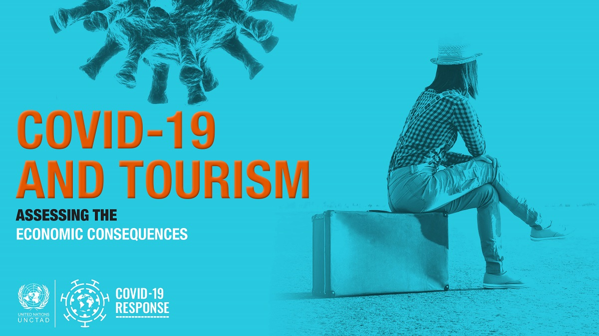

 
 

# Covid-vs-Tourism
Analysis of COVID19 effect on CROBEX Turist.

  

 
 

## Overview

The impact of COVID-19 pandemic on tourism share prices in Croatia

Purpose - The COVID-19 pandemic, unprecedented in the speed of global spread, affected the whole world swiftly after the initial outbreak and produced heterogeneous effects on various industrial sectors and particularly pronounced effects on the tourism industry. This paper analyzes the financial impact of the pandemic on the tourism industry in Croatia in order to provide findings about the financial consequences it has caused on the listed firms in tourism sector. This research can be characterized of special interest for the tourism dependent country like Croatia.
Methodology – In order to examine the financial impact of the COVID-19 pandemic on the tourism industry in Croatia, the research is conducted in several phases. First, the analysis documents the Croatian tourism sector stock market performance before and after the outbreak of pandemic. Second, the effects and channels of COVID-19 shock to the tourism sector market valuation are evaluated with the ordinary least squares estimation and several generalized autoregressive conditional heteroskedastic specifications of residual structure. Third, the differences of COVID-19 shock across sectoral stock market components and market average are analyzed so that the relative impact on tourism sector can be established. The relative impact of COVID-19 shock on the valuation of sectoral market components is tested with conventional t-tests and respective nonparametric variants. The assumptions that describe the estimated functional form and relationships among variables are confirmed to imply appropriate estimation and inference procedures.

Findings – COVID-19 undoubtedly had a significant impact on Croatia, which is heavily dependent on tourism and international tourism trends. Our findings indicate pronounced effects of the global COVID-19 pandemic on the tourism industry in the local market along with the sizable impact of lockdown measures and the intensity of global pandemic spread. The preliminary results point to the bigger impact of COVID-19 shock on the tourism sector index relative to the overall local market average return.

Contribution - This research offers a novel comprehensive review of the literature in the research topic and provides insights into local sectoral effects of the global financial shock caused by COVID-19 pandemic. Since this pandemic is increasing the market volatility, this research will be of importance to fund managers and carries implications for economic policy in terms of sectoral stimulus distribution and debt refinancing. The outcomes of this research will help policymakers to ensure sustainability of tourism companies and to overcome future crisis.

The paper is avaliable on the [link](https://raw.githack.com/lusiki/Covid-vs-Tourism/main/Covid-vs-Tourism-PAPER.html)

